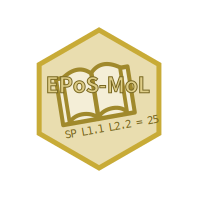

# Welcome to EPoS-MoL

While the official shorthand nomenclature of lipids is a first and important step towards a reporting quality tool, an additional point score reflects the quality of reported data at an even more detailed granularity. Thus, the **E**mpirical **Po**int **S**core **Mo**del for MS-based **L**ipidomics (EPoS-MoL) is a lipidomics scoring scheme which takes into account all the different layers of analytical information to be obtained by mass spectrometry, chromatography and ion mobility spectrometry and awards scoring points for each of them.

Furthermore the scoring scheme is integrated with the annotation levels as proposed by the official shorthand nomenclature, with a point score which roughly correlates with the annotated compound details. The merit of such a scoring system is the fact, that it abstracts data quality into a number which gives even the non-lipidomics expert an idea about the reporting quality at first glance. Additionally it could serve as an tool supporting self-control of researchers and for data quality assessment in the peer review process.

If you use EPoS-MoL, please cite the following publication:

** TODO **

More information and support for EPoS-ML is available at <a href="https://github.com/lifs-tools/empirical-lipid-ms-score" target="_blank">https://github.com/lifs-tools/empirical-lipid-ms-score</a>

## EPoS-MoL Webapplication

This web application provides a sample spreadsheet file containing two examples (long and wide format) that should cover the most common output formats of lipid identification tools, or at least a good approximation thereof. The intention is to have a format that is easy to create and process. The wide format may be easier for manual editing, while the long format may be more suitable for a compact representation and for automated creation by tools. 
You can load the example data by clicking on the 'Load example data' button on the left. Alternatively, you can also download the example to inspect it locally.

## References

[1] D. Kopczynski, N. Hoffmann, B. Peng, G. Liebisch, F. Spener, and R. Ahrends, "Goslin 2.0 Implements the Recent Lipid Shorthand Nomenclature for MS-Derived Lipid Structures," Anal. Chem., vol. 94, no. 16, pp. 6097–6101, Apr. 2022, doi: https://doi.org/10.1021/acs.analchem.1c05430

[2] G. Liebisch *et al.*, "Update on LIPID MAPS classification, nomenclature, and shorthand notation for MS-derived lipid structures," J Lipid Res, vol. 61, no. 12, pp. 1539–1555, Dec. 2020, doi: https://doi.org/10.1194/jlr.S120001025
